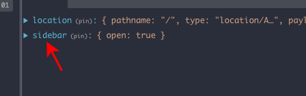

This project was bootstrapped with [Create React App](https://github.com/facebook/create-react-app).
And [`rewired`](https://github.com/timarney/react-app-rewired) instead of [`ejected`](https://facebook.github.io/create-react-app/docs/available-scripts#npm-run-eject)

Arcgis JS is consumed as React components through [react-arcgis](https://github.com/Esri/react-arcgis)

Clone the repo and run `yarn install` to install the needed dependencies.

## Available Scripts

In the project directory, you can run:

### `yarn start`

Runs the app in the development mode.<br>
Open [http://localhost:3000](http://localhost:3000) to view it in the browser.

The page will reload if you make edits.<br>
You will also see any lint errors in the console.

### `yarn test`

Launches the test runner in the interactive watch mode.<br>
See the section about [running tests](https://facebook.github.io/create-react-app/docs/running-tests) for more information.

### `yarn run build`

Builds the app for production to the `build` folder.<br>
It correctly bundles React in production mode and optimizes the build for the best performance.

The build is minified and the filenames include the hashes.<br>
Your app is ready to be deployed!

See the section about [deployment](https://facebook.github.io/create-react-app/docs/deployment) for more information.


### `config-overrides`

This file is ised to override/extend the default `create-react-app` webpack configuration.

Since `create-react-app` version 2 is used under the hoods no configuration to allow the use of [`CSSModules`](https://facebook.github.io/create-react-app/docs/adding-a-css-modules-stylesheet) is needed. Just have in mind that for it to work the file naming convention `file-name.module.scss` should be followed.

### Routing

[`0.0.9-rudy`](https://www.npmjs.com/package/redux-first-router/v/0.0.9-rudy) version of `redux-first-router` is used.
This routing approach let us fetch and add data to the store on a route basis, via [`thunks`](https://www.npmjs.com/package/redux-first-router/v/0.0.9-rudy#routesmap-with-thunk).
It also allows the updating of URL params through actions easing the reaction to those updates in all the connected components (and even triggering side effects through sagas middleware).


### State Management

For state management we are using `Redux`.
To avoid loading all redux modules on the first load when we initialize the `store` (for detailed implementation check out `store.js` file) we introduced code-splitting as indicated in this [`article`](http://nicolasgallagher.com/redux-modules-and-code-splitting/). There are few files that make it possible:
* reducerRegistry.js - class that enables adding redux reducers to the store's reducer after the store has been already created - loading on-demand. This class has a `register` method that we use for adding reducers to the store on-demand.
* store.js
  * first we register reducers that we need on first load
  ```
    import reducerRegistry from 'reducerRegistry';
    reducerRegistry.register('location', router.reducer);
  ```
  * we add a listener that listens for new reducers to be registered and replace store's reducer whenever that happens (whenever `register` method from `reducerRegistry` class is called).
* some-example-redux-module.js - we split redux code into self-contained modules that comprise of a reducer, actions and initial state. In their index files that combine all of them together (we give them module's name, i.e. `sidebar.js`) we register module into redux's store:
  ```
  reducerRegistry.registerModule('sidebar', {
    actions,
    reducers,
    initialState
  });
  ```
  


